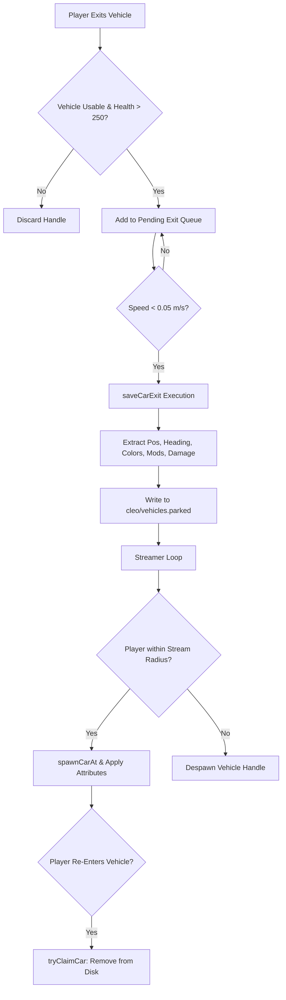

# GTA SA Parked Vehicles Persistent Streamer

A CLEO Redux script (`car_exit_logger[fs].sa.js`) for Grand Theft Auto: San Andreas. The system automatically records, saves, and streams back every vehicle exited by the player, retaining location, orientation, colors, visual damage, popped tires, tuning upgrades, paintjobs, and health across game sessions and reloads.

---

## Features

- **Automatic Exit Persistence**: Automatically saves vehicle state when the player exits a vehicle and stops moving.
- **Dynamic Distance-Based Streaming**: Spawns and despawns vehicles within a configurable radius around the player (`streamRadius`) without exceeding memory limits (`maxStreamed`).
- **State Auto-Update**: Detects when a parked vehicle is moved or damaged while stationary, dynamically updating its entry in disk storage.
- **Vehicle Reclaim System**: When the player re-enters a persistent parked vehicle, its record is claimed and removed from disk so it becomes a standard player vehicle again.
- **Interactive F6 Management Menu**: On-screen GUI to list parked vehicles, teleport to any vehicle, repair, unlock, or clear persistent records.
- **Hot-Reload Support (F7)**: Reload configuration settings and re-stream all parked vehicles instantly in-game without restarting.
- **Built-in `PACKER` Cheat**: Type `PACKER` on the keyboard to spawn a Packer (model 443) utility truck positioned 2 meters in front of CJ.
- **Zero Hardcoded Model Lists**: Dynamically classifies vehicle types (boats, aircraft, bikes, automobiles) via native GTA SA engine opcodes (`IsThisModelABoat`, `IsThisModelAHeli`, `IsThisModelAPlane`, `IsThisModelACar`), fully supporting custom modded and add-on vehicle models without script modification.

---

## Configuration (`car_exit_logger.ini`)

The script reads its configuration settings from `cleo\car_exit_logger.ini`. Below are the configurable keys:

| Setting | Default | Description |
| :--- | :--- | :--- |
| `MaxEntries` | `20` | Maximum number of persistent parked vehicles saved on disk simultaneously. |
| `StreamRadius` | `150.0` | Maximum distance (in meters) around CJ within which persistent vehicles are spawned. |
| `MaxStreamed` | `10` | Maximum number of persistent vehicles allowed to exist in game memory at once. |
| `UnlockDoors` | `1` | Automatically unlocks vehicle doors upon spawn (`1` = enabled, `0` = locked). |
| `SaveHealth` | `1` | Saves exact vehicle engine health (`1` = enabled, `0` = force 1000 HP). |
| `SaveTires` | `1` | Saves popped tire states (`1` = enabled, `0` = standard intact tires). |
| `Tooltips` | `1` | Displays top-right HUD notification text boxes for actions (`1` = enabled, `0` = disabled). |

---

## Data Format (`vehicles.parked`)

Persistent entries are written to `cleo\vehicles.parked` using an ultra-minified pipe-delimited format:

```text
modelId|x,y,z|heading|primaryColor,secondaryColor,extraColor1,extraColor2|paintjob|health|tires|panels|doors|upgrades
```

### Format Specification
1. `modelId`: Vehicle model ID (e.g. `443` for Packer).
2. `x,y,z`: Floating-point coordinates formatted to 2 decimal places.
3. `heading`: 2D rotation angle in degrees formatted to 1 decimal place.
4. `colors`: Comma-separated primary, secondary, and optional extra color IDs.
5. `paintjob`: Paintjob index (`0`-`3`) or empty if standard paint.
6. `health`: Engine health value (`251`-`1000`).
7. `tires`: Comma-separated array of popped tire indices (`0`-`5`).
8. `panels`: Comma-separated array of damaged panel states.
9. `doors`: Comma-separated array of damaged door states.
10. `upgrades`: Comma-separated array of installed tuning component IDs (`1000`-`1193`).

---

## System Architecture & Technical Flow



---

## Comprehensive Function Reference

Below is a detailed technical reference for all functions in `car_exit_logger[fs].sa.js`:

### Log & Interface Utilities

#### `log(msg)`
Appends a formatted string timestamp and message to `cleo_redux.log` and standard output.

#### `showTextBox(str)`
Renders a top-right HUD text notification box using native game text formatting.

#### `drawBox(x, y, w, h, r, g, b, a)`
Draws a 2D screen space rectangle for the F6 GUI menu using primitive graphics opcodes.

#### `drawHeader(title)`
Renders the top header banner and title text for the F6 menu UI.

#### `drawFooter(text)`
Renders navigation instructions and key legends at the bottom of the F6 menu UI.

#### `drawMenuItem(idx, selectedIdx, label, valueText, isHeader)`
Draws a single interactive row item in the F6 menu with selection highlight coloring.

#### `drawMenuBackground(itemCount)`
Calculates layout dimensions and draws translucent background panels for the F6 menu.

#### `drainKeys()`
Flushes input buffers and waits briefly until key presses (e.g. F6, F7, Return, Space) are released, preventing key bleed between menus and gameplay.

---

### Configuration & Storage I/O

#### `loadConfig()`
Reads `cleo\vehicles.ini` from disk, parses key-value pairs, and populates global configuration settings.

#### `saveConfig()`
Serializes active global configuration parameters back to `cleo\vehicles.ini`.

#### `writeDisk(entries)`
Writes the array of minified parked vehicle strings into `cleo\vehicles.parked` under the `[Vehicles]` INI header.

#### `readDisk()`
Reads `cleo\vehicles.parked`, parses all `EntryX` keys, and returns an array of valid minified strings.

#### `parseIniLine(line)`
Splits an INI line by the `=` delimiter and returns key and value strings.

#### `formatIniLine(key, val)`
Formats a key and value into a standardized `Key=Value` INI line string.

#### `formatMinifiedEntry(d)`
Constructs a single minified pipe-delimited entry string from a vehicle state object `d`.

#### `parseEntry(line)`
Parses a minified pipe-delimited entry string into a structured JavaScript vehicle data object `d`.

---

### Vehicle Classification & Entity Wrappers

#### `isBoatModel(mid)`
Queries the native game engine opcode `Car.IsThisModelABoat(mid)` to dynamically identify watercraft without static model lists.

#### `isAircraftModel(mid)`
Queries native engine opcodes `Car.IsThisModelAHeli(mid)` and `Car.IsThisModelAPlane(mid)` to dynamically identify helicopters and airplanes without static model lists.

#### `isAutomobileModel(mid)`
Queries `Car.IsThisModelACar(mid)` to dynamically identify cars, trucks, and vans without static model lists.

#### `isBikeModel(mid)`
Evaluates native vehicle classification queries to identify motorcycles and bicycles without static model lists.

#### `toCar(c)`
Ensures a given input `c` (handle or object) is wrapped into a valid CLEO Redux `Car` object wrapper.

#### `getCarHandle(c)`
Extracts the integer handle value from a `Car` object or handle reference.

#### `isCarValid(c)`
Checks if the vehicle instance exists in game memory and is not a null pointer.

#### `isCarDestroyed(c)`
Returns `true` if the vehicle is blown up, on fire, or engine health is <= 250 HP.

#### `isCarUsable(c)`
Verifies that the vehicle is valid and not destroyed.

#### `getCarModelId(c)`
Retrieves the GTA SA model ID (`400`-`611`) for the specified vehicle.

#### `getCarPos(c)`
Returns 3D spatial coordinates `{ x, y, z }` for the specified vehicle.

#### `getCarHdg(c)`
Returns 2D z-rotation (heading angle in degrees) for the specified vehicle.

#### `getCarHealth(c)`
Retrieves current engine health points (`0`-`1000`).

#### `setCarHealth(c, hp)`
Sets engine health points for the specified vehicle instance.

#### `getCarColors(c)`
Retrieves primary (`c1`) and secondary (`c2`) color IDs.

#### `setCarColors(c, c1, c2)`
Applies primary and secondary color IDs to a vehicle.

#### `getCarExtraColors(c)`
Retrieves tertiary (`c3`) and quaternary (`c4`) extra color IDs.

#### `setCarExtraColors(c, c3, c4)`
Applies extra color IDs to a vehicle instance.

#### `getCarPaintjob(c)`
Retrieves active paintjob index (`0`-`3`) or `-1` if none applied.

#### `setCarPaintjob(c, pj)`
Applies a paintjob texture index to a vehicle.

#### `getCarMods(c, modelId)`
Queries vehicle tuning component slots and returns an array of installed mod model IDs (`1000`-`1193`).

#### `probeAndCacheTunability(c, modelId)`
Pre-loads and verifies tuning component compatibility for a vehicle model upon entry.

#### `getCarPoppedTires(c)`
Inspects wheel statuses and returns an array of popped tire indices (`0`-`5`).

#### `setCarPoppedTires(c, tires)`
Applies popped states to specified tire indices on a vehicle.

#### `getCarDamage(c)`
Inspects visual damage structures and returns arrays of damaged panel and door states.

#### `applyStoredDamage(c, panels, doors)`
Applies panel and door deformation damage states to a newly spawned vehicle.

#### `getCarSpd(c)`
Calculates magnitude of 3D velocity vectors to determine movement speed in m/s.

#### `getVehicleName(modelId)`
Converts vehicle model IDs to human-readable GXT text names (e.g. `443` -> `"Packer"`).

---

### Streamer & Spawn Engine

#### `spawnCarAt(modelId, x, y, z)`
Loads the vehicle model into memory synchronously (`loadModelSync`), creates the vehicle entity without height safety offsets (`setCoordinatesNoOffset`), marks the model as no longer needed, and returns the vehicle handle.

#### `loadModelSync(id)`
Requests a model ID into streaming memory and executes `LoadAllModelsNow` to guarantee immediate availability.

#### `deleteCarHandle(c)`
Deletes a vehicle entity safely from game memory.

#### `clearNearbyNonTracked(x, y, z, r, playerCar)`
Searches a sphere of radius `r` (2.0 meters) around spawn coordinates and despawns non-tracked ambient vehicles to prevent overlapping collisions.

#### `teleportTo(d)`
Teleports CJ and CJ's active vehicle directly to the coordinates of a persistent parked vehicle.

#### `getUniqueKey(d)`
Generates a unique string key (`modelId_x_y_z`) to identify persistent vehicles in active memory tracking tables.

#### `runStreamer(char)`
Main streaming loop. Iterates through all persistent disk records, calculates distance squared relative to player coordinates, spawns missing entries within `streamRadius`, and despawns entries outside `streamRadius`.

#### `updateParkedCarStateIfNeeded(h, d, i, entries)`
Checks stationary streamed vehicles against their stored coordinates. If a parked vehicle is moved >= 0.5m or turned >= 5.0 degrees, it updates its record in `vehicles.parked`.

#### `gatherAndUpdateAllOnStart()`
Scans existing parked vehicle entries on script startup/reload and verifies structural integrity.

---

### Event & Exit Tracking Engine

#### `tryClaimCar(car, char)`
Checks if player has entered a persistent parked vehicle. If matched, removes the entry from `vehicles.parked` and hands ownership back to the player.

#### `runPending(char)`
Monitors vehicles queued after player exit. Once vehicle speed drops below `0.05 m/s`, triggers `saveCarExit`.

#### `saveCarExit(car)`
Extracts full state from an exited vehicle, formats a minified entry line, appends to `vehicles.parked`, updates cache, and adds handle to active streamer tracking.

#### `checkCheatCodes(player, char)`
Monitors user keyboard input using `Pad.TestCheat("PACKER")`. Spawns a Packer truck (model 443) 6.0 meters in front of CJ (placing its bumper 2 meters away).

#### `runMenu(player, char)`
Executes the interactive F6 GUI management menu loop, providing options to list, teleport to, repair, unlock, or purge parked vehicle entries.

---

## License

Distributed under the MIT License. Free for modification and distribution in GTA San Andreas modding projects.
